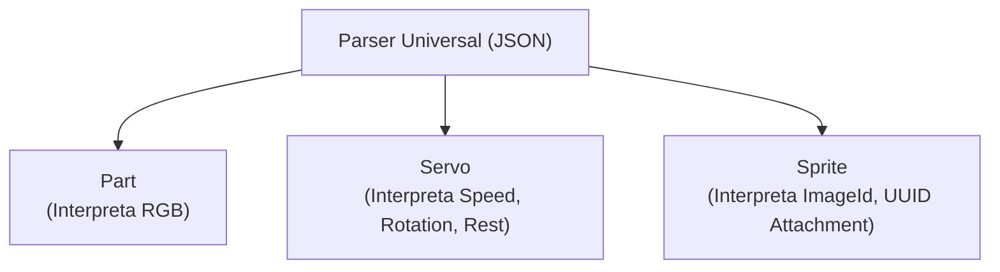
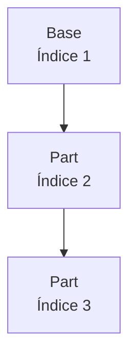
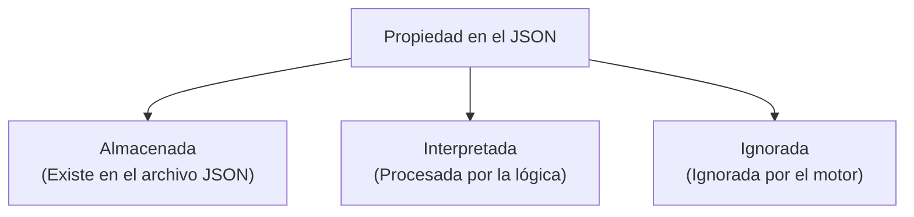
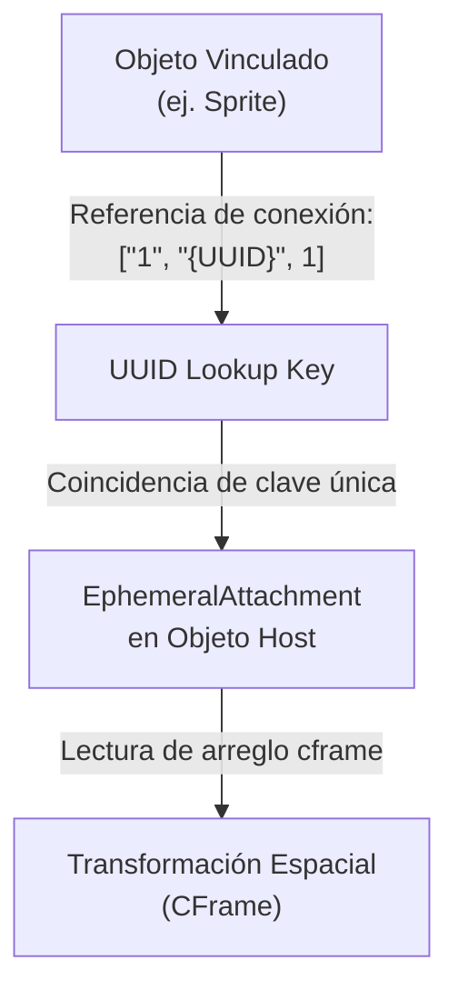
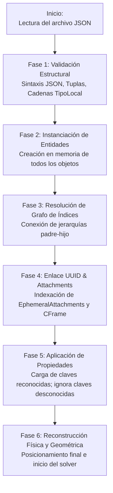

# RtG Save Format Specification v0.406

> **Hecho po:** @JuanCrakYT
> **Documento:** Especificación Técnica de Formato de Guardado (Ingeniería Inversa)  
> **Juego Objetivo:** Road To Gramby's (Roblox)  
> **Versión de la Especificación:** v1.101  
> **Estado:** Documento Experimental / No Oficial  
> **Fecha de actualización:** 15/08/2026

---

## 1. Introducción
El presente documento constituye la especificación técnica no oficial del formato de guardado (*save format*) utilizado por el videojuego **Road To Gramby's (RtG)** en la plataforma Roblox. Toda la información contenida en este documento ha sido obtenida mediante **ingeniería inversa empírica**, analizando y modificando archivos JSON comprimidos en Base64 de construcciones (*builds*) e inspeccionando el comportamiento del motor del juego al procesarlos.

El propósito principal de esta especificación es documentar exhaustivamente el funcionamiento interno del sistema de serialización de objetos, la red de conexiones y dependencias jerárquicas, la inyección espacial de transformaciones mediante attachments y las reglas del cargador del juego.

### 1.1 Modelo conceptual del sistema
#### Modelo en texto
```text
BUILD
└── Objetos
    ├── Tipo
    ├── Conexiones
    │   ├── TipoLocal
    │   ├── PuntoPadre
    │   │   └── Referencia A UUID
    │   └── ÍndicePadre
    │       └── Array 1-based
    │
    └── Propiedades
        └── Attachments
            ├── CFrame
            └── UUID
```

#### Modelo en Formato Mermaid

```mermaid
flowchart TD
flowchart TD
    BUILD["BUILD"]

    BUILD --> OBJ["Objetos"]

    OBJ --> TYPE["Tipo"]
    OBJ --> CONNECTIONS["Conexiones"]
    OBJ --> PROPERTIES["Propiedades"]

    CONNECTIONS --> LOCALTYPE["TipoLocal"]
    CONNECTIONS --> PRIMARYID["PuntoPadre"]
    CONNECTIONS --> PRIMARYINDEX["ÍndicePadre"]

    PRIMARYINDEX --> PRIMARYINDEX1BASED["Array 1-based"]
    PRIMARYID -. "Referencia a" .-> ATTACH["Attachment"]

    PROPERTIES --> ATTACH

    ATTACH --> CFRAME["CFrame"]
    ATTACH --> UUID["UUID"]
```

---

## 2. Filosofía del formato
> **Hecho por:** @JuanCrakYT
El sistema de guardado de Road To Gramby's no almacena las construcciones como una colección estática de coordenadas absolutas en el espacio tridimensional. En su lugar, almacena una **descripción estructural reconstruible**.

$$\text{Objetos} + \text{Referencias} + \text{Attachments} + \text{Propiedades} = \text{Construcción Final}$$

* **Grafo de Dependencias:** El archivo JSON representa esencialmente un grafo de dependencias y relaciones jerárquicas.
* **Cálculo Dinámico:** La posición tridimensional final de cada bloque no está codificada en el archivo; se reconstruye dinámicamente durante el proceso de carga resolviendo las referencias a bloques padres y los marcos de coordenadas de attachments (*CFrames*).
* **Flexibilidad Estructural:** Esta arquitectura permite que el cargador interprete configuraciones espaciales complejas e inyecciones de posición que el editor visual del juego no permitiría generar directamente.

---

## 3. Estructura general del JSON
> **Hecho por:** @JuanCrakYT
Una construcción (*build*) de RtG se almacena como un arreglo JSON de nivel superior (`Array` 1-based). Cada elemento dentro de este arreglo representa de forma unívoca un bloque u objeto dentro de la creación.

```json
[
    ["Base", [], {}],
    ["Part", [["1", "5", 1]], {"RGB": [255, 0, 0]}],
    ["Part", [["1", "5", 2]], {"RGB": [0, 255, 0]}]
]
```

### 3.1 Tupla de Objeto Base
Cada elemento del arreglo se define como una tupla con un tamaño fijo de tres elementos con el siguiente formato secuencial:

```json
[
    TipoLocal,
    Conexiones,
    Propiedades
]
```
---
| Índice Interno | Tipo de Dato | Nombre        | Descripción                                        |
| :------------: | :----------: | :------------ | :------------------------------------------------- |
|      `0`       |   `String`   | `TipoLocal`   | Identificador del tipo de objeto o entidad.        |
|      `1`       |   `Array`    | `Conexiones`  | Arreglo de tuplas de conexión con el bloque padre. |
|      `2`       |   `Object`   | `Propiedades` | Diccionario JSON de atributos asociados al bloque. |
---
* **Regla:** El orden de los 3 elementos dentro de la tupla `[TipoLocal, Conexiones, Propiedades]` es inmutable y validado por el parser universal.

### 3.11 Tabla de TipoLocal por objeto
> **Hecho por:** @JuanCrakYT
Esta tabla registra el `TipoLocal` observado para cada tipo de objeto.
Se ha observado que cada tipo de objeto utiliza un número `TipoLocal` determinado. Estos números permiten al formato identificar el tipo de objeto asociado a una conexión.
El mecanismo interno mediante el cual RtG utiliza estos valores y el significado específico de cada número no se ha determinado.
Por lo tanto, `TipoLocal` debe tratarse como un identificador observado, no como una clasificación semántica confirmada.
---
|   ID | Nombre            | TipoLocal | Descripción                                                  |
| ---: | ----------------- | :-------: | ------------------------------------------------------------ |
|    1 | GoldPotatoEngine  |     1     | Motor de alta potencia. Variante mejorada del Potato Engine. |
|    2 | TripWire          |     1     | Sensor mediante cable que detecta interrupciones.            |
|    3 | ToolGun           |     —     | Herramienta especial. No posee conexiones propias.           |
|    4 | Servo             |     1     | Servo rotacional configurable.                               |
|    5 | Toilet            |     1     | Objeto decorativo/interactivo.                               |
|    6 | Clipboard         |     1     | Portapapeles interactivo.                                    |
|    7 | DoorB             |     1     | Variante B de puerta.                                        |
|    8 | Rope              |     1     | Cable o cuerda que une dos referencias.                      |
|    9 | Poop              |     1     | Objeto decorativo.                                           |
|   10 | BeachChair        |     1     | Silla de playa.                                              |
|   11 | Rocket            |     1     | Cohete propulsor.                                            |
|   12 | EntitySensor      |     7     | Sensor de entidades cercanas.                                |
|   13 | Board             |    15     | Tabla de madera.                                             |
|   14 | PotatoEngine      |     1     | Motor básico del juego.                                      |
|   15 | Joint             |     2     | Unión mecánica entre piezas.                                 |
|   16 | RemoteButton      |     1     | Botón remoto.                                                |
|   17 | Ramp              |     —     | Rampa. Utiliza únicamente EphemeralAttachments.              |
|   18 | Lock              |     1     | Bloque de bloqueo.                                           |
|   19 | Connector         |     5     | Conector esférico.                                           |
|   20 | Tooth             |     —     | Diente. Solo utiliza EphemeralAttachments.                   |
|   21 | Roof              |     1     | Techo.                                                       |
|   22 | Switch            |     1     | Interruptor.                                                 |
|   23 | Radio             |     1     | Radio configurable.                                          |
|   24 | Leg               |     1     | Pierna mecánica.                                             |
|   25 | Button            |     1     | Botón físico.                                                |
|   26 | Trunk             |     1     | Baúl.                                                        |
|   27 | Pie               |     1     | Pastel.                                                      |
|   28 | CannonBall        |     1     | Munición de cañón.                                           |
|   29 | Base              |     3     | Base estructural principal.                                  |
|   30 | Leafblower        |     1     | Sopladora.                                                   |
|   31 | Wing              |     1     | Ala aerodinámica.                                            |
|   32 | Anchor            |     1     | Ancla.                                                       |
|   33 | Grenade           |     1     | Granada.                                                     |
|   34 | StaringGyro       |     1     | Giroscopio que sigue un objetivo.                            |
|   35 | Servo_Physics     |     1     | Servo físico con simulación.                                 |
|   36 | Briefcase         |     —     | Maletín. Sin datos de conexión.                              |
|   37 | HalfConnectorBall |     6     | Medio conector esférico.                                     |
|   38 | Gramby            |     1     | Personaje/NPC.                                               |
|   39 | MountedGun        |     1     | Ametralladora montada.                                       |
|   40 | Uzi               |     2     | Arma automática.                                             |
|   41 | ConnectorBall     |     6     | Conector esférico.                                           |
|   42 | ShoppingCart      |     —     | Carrito de compras.                                          |
|   43 | Note              |     1     | Nota de texto.                                               |
|   44 | Gate-AND          |     4     | Compuerta lógica AND.                                        |
|   45 | Thruster          |     1     | Propulsor.                                                   |
|   46 | BowlingBall       |     6     | Bola de bolos.                                               |
|   47 | Cinderblock       |     1     | Bloque de concreto.                                          |
|   48 | Joust             |     1     | Lanza/Joust.                                                 |
|   49 | InputSensor       |     2     | Sensor de entrada.                                           |
|   50 | Bumper            |     1     | Parachoques.                                                 |
|   51 | DoorA             |     1     | Variante A de puerta.                                        |
|   52 | Arm               |     1     | Brazo mecánico.                                              |
|   53 | RPG               |     1     | Lanzacohetes.                                                |
|   54 | Carrot            |     1     | Zanahoria.                                                   |
|   55 | Cone              |     3     | Cono.                                                        |
|   56 | SteeringWheel     |     1     | Volante.                                                     |
|   57 | SteeringGyro      |     1     | Giroscopio de dirección.                                     |
|   58 | Tire              |     1     | Llanta.                                                      |
|   59 | Balloon           |     1     | Globo.                                                       |
|   60 | Gyro              |     1     | Giroscopio.                                                  |
|   61 | DoorC             |     1     | Variante C de puerta.                                        |
|   62 | SpringJuice       |     1     | Consumible.                                                  |
|   63 | WoodenChair       |     2     | Silla de madera.                                             |
|   64 | Chassis           |     —     | Chasis. Solo utiliza EphemeralAttachments.                   |
|   65 | FuelTank          |     2     | Tanque de combustible.                                       |
|   66 | Mag               |     1     | Cargador de munición.                                        |
|   67 | Keyboard          |     —     | Teclado. Solo utiliza EphemeralAttachments.                  |
|   68 | RiotShield        |     —     | Escudo antidisturbios.                                       |
|   69 | Spoiler           |     2     | Alerón.                                                      |
|   70 | Jug               |     —     | Jarra.                                                       |
|   71 | Pipes             |     1     | Tuberías.                                                    |
|   72 | Trowel            |     —     | Paleta.                                                      |
|   73 | LongStick         |     2     | Palo largo.                                                  |
|   74 | ShortStick        |     2     | Palo corto.                                                  |
|   75 | Stick             |     2     | Palo.                                                        |
|   76 | Wire              |     3     | Cable eléctrico.                                             |
|   77 | Gate-OR           |     4     | Compuerta lógica OR.                                         |
|   78 | Hood              |     1     | Capó.                                                        |
|   79 | Splitter_1        |     3     | Divisor de señal (1 salida principal).                       |
|   80 | HulaDoll          |     1     | Muñeca decorativa.                                           |
|   81 | Part              |     1     | Bloque estructural básico.                                   |
|   82 | Camera            |     1     | Cámara.                                                      |
|   83 | Light             |     1     | Luz.                                                         |
|   84 | GlassBase         |     3     | Base de vidrio.                                              |
|   85 | Sprite            |     1     | Imagen plana.                                                |
|   86 | RubberBand        |     1     | Banda elástica.                                              |
|   87 | Cannon            |     1     | Cañón.                                                       |
|   88 | Shotgun           |     2     | Escopeta.                                                    |
|   89 | Splitter_4        |     1     | Divisor de cuatro salidas.                                   |
|   90 | Seat              |     1     | Asiento.                                                     |
|   91 | Detacher          |     1     | Desconector.                                                 |
|   92 | Plunger           |     1     | Destapador.                                                  |
|   93 | Gate-NOT          |     4     | Compuerta lógica NOT.                                        |
|   94 | FishBowl          |     1     | Pecera.                                                      |
|   95 | Gun               |     2     | Pistola.                                                     |
|   96 | BallSocket        |     1     | Articulación esférica.                                       |
|   97 | Splitter_3        |     3     | Divisor de tres salidas.                                     |
|   98 | Splitter_2        |     3     | Divisor de dos salidas.                                      |
|   99 | Googie            |     1     | Objeto decorativo.                                           |
|  100 | BeachBall         |     6     | Pelota de playa.                                             |
|  101 | Canister          |     1     | Contenedor.                                                  |
|  102 | Propeller         |     2     | Hélice.                                                      |
|  103 | Sledge            |     1     | Mazo.                                                        |
|  104 | Delayer           |     2     | Retardo lógico.                                              |
|  105 | Looper            |     1     | Repetidor temporal.                                          |
|  106 | wad               |     —     | Objeto auxiliar con EphemeralAttachments.                    |
|  107 | BouncyBall        |     6     | Pelota rebotadora.                                           |
|  108 | Recorder          |     1     | Grabadora.                                                   |
|  109 | DoorD             |     1     | Variante D de puerta.                                        |
|  110 | Piston            |     2     | Pistón configurable.                                         |
|  111 | Bearing           |     1     | Rodamiento.                                                  |
|  112 | VelocitySensor    |     2     | Sensor de velocidad.                                         |
|  113 | SprayPaint        |     1     | Pintura en aerosol.                                          |
|  114 | BrakeLight        |     1     | Luz de freno.                                                |
|  115 | AltitudeSensor    |     2     | Sensor de altitud.                                           |
|  116 | RockingChair      |     1     | Silla mecedora.                                              |
|  117 | MatchingGyro      |     2     | Giroscopio de coincidencia.                                  |
|  118 | Head              |     1     | Cabeza de Fricklet.                                          |
|  119 | PolaroidCamera    |     1     | Cámara Polaroid.                                             |
|  120 | PolaroidPhoto     |     1     | Fotografía Polaroid.                                         |
|  121 | Successor         |     2     | A Worthy Successor.                                          |
|  122 | Body              |     —     | Cuerpo de Fricklet.                                          |
|  123 | Fricklet          |     —     | Fricklet.                                                    |
|  124 | SuperPowerClock   |     —     | Super Power Clock.                                           |
|  125 | YibYib            |     —     | YibYib.                                                      |
---

> **Importante:** Aquí aparecen algunos objetos con "—" en `TipoLocal`, y esas entradas se describen como *objetos que no pueden conectarse a otros.*
> **Nota:** Conocer el `TipoLocal` de un objeto no implica conocer qué representa internamente ese número.

## 4. Modelo de datos de objetos
> **Hecho por:** @JuanCrakYT
Todos los objetos dentro del formato de guardado de RtG comparten exactamente la misma estructura base JSON:

$$\text{Objeto RtG} = [\text{TipoLocal}, \text{Conexiones}, \text{Propiedades}]$$

Sin embargo, cada tipo de objeto posee comportamientos internos y reglas de procesamiento diferenciadas en la lógica del juego.

```text
                  Parser Universal (JSON)
                             │
       ┌─────────────────────┼─────────────────────┐
       │                     │                     │
       ▼                     ▼                     ▼
     Part                  Servo                 Sprite
(Interpreta RGB)    (Interpreta Speed,   (Interpreta ImageId,
                      Rotation, Rest)       UUID Attachment)
```
> Aquí se ve en formato **Mermaid:**


### 4.1 Interpretación Homogénea vs. Procesamiento Específico
La diferencia entre distintos bloques no radica en el formato de la sintaxis JSON, sino en **cómo cada objeto interpreta internamente el diccionario de propiedades y el grafo de conexiones**. Un objeto `Part` procesará claves relativas al aspecto visual (`RGB`), mientras que un `Servo` procesará parámetros cinemáticos (`Speed`, `LimitAngle`), compartiendo la misma estructura sintáctica subyacente.

---

## 5. Tipos de objetos
> **Hecho por:** @JuanCrakYT
El primer valor de la tupla es una cadena de texto identificadora (`String`) que indica la plantilla lógica del bloque.

### 5.1 Ejemplos Identificadores Conocidos
Ejemplos de identificadores de bloques observados en las pruebas:
* `"Base"`
* `"Part"`
* `"Servo"`
* `"Connector"`
* `"Splitter_4"`
* `"ToolGun"`
* `"Wheel"`
* `"Chassis"`
* `"Sprite"`
* `"Rope"`
* `"Wire"`
* `"Balloon"`
* `"Joint"`
* `"RiotShield"`
> Para ver más, vaya a: `obj_ids.md`

### 5.2 Homogeneidad y Ausencia de Bloques Especiales
* **Clarificación de Ingeniería Inversa:** Pruebas experimentales extensas demuestran que el motor trata a todos los objetos con la misma especificación técnica. Objetos como `"Chassis"` no cuentan con un estatus privilegiado; fueron utilizados inicialmente en pruebas experimentales debido a que permitían visualizar de manera limpia el uso de `EphemeralAttachments`.
* Cada tipo de objeto:
  1. Utiliza un subconjunto de puntos de conexión física conocidos.
  2. Acepta determinados códigos de `TipoLocal`.
  3. Interpreta claves específicas dentro del diccionario abierto de propiedades.

---

## 6. Sistema de conexiones
> **Hecho por:** @JuanCrakYT
El segundo elemento de la tupla de objeto es una lista de conexiones (`Conexiones`). Define las dependencias mecánicas, lógicas y jerárquicas del bloque con respecto a otros objetos.

```json
[
    ["1", "5", 12]
]
```

Un bloque puede incluir cero conexiones (como un bloque raíz `"Base"` con `[]`), una conexión única, o múltiples conexiones (por ejemplo, distribuidores de señal o splitters):

```json
[
    ["3", "5", 140],
    ["5", "2", 18],
    ["9", "2", 55]
]
```

### 6.1 Formato de la Tupla de Conexión
> **Hecho por:** @JuanCrakYT
Cada entrada en la lista de conexiones consta exactamente de un arreglo de 3 elementos:

```json
[
    TipoLocal,
    PuntoPadre,
    ÍndicePadre    // 1-based
]
```

| Posición |   Tipo de Dato    | Componente    | Descripción                                                  |    Estado    |
| :------: | :---------------: | :------------ | :----------------------------------------------------------- | :----------: |
|    1º    |     `String`      | `TipoLocal`   | Identificador de interfaz/puerto del bloque local.           | ✅ Confirmado |
|    2º    | `String` / `UUID` | `PuntoPadre`  | Punto físico o UUID del attachment de enlace del padre.      | ✅ Confirmado |
|    3º    |     `Integer`     | `ÍndicePadre` | Índice de posición del bloque padre en el arreglo principal. | ✅ Confirmado |

---

> **Nota sobre `TipoLocal`:** Cada tipo de objeto observado utiliza un `TipoLocal` propio. Se desconoce el significado interno de estos números y el mecanismo exacto mediante el cual RtG los utiliza. Por ahora, se tratan como identificadores observados asociados a tipos de objeto.

## 7. Índices y referencias

### 7.1 Definición de ÍndicePadre (✅ Confirmado)
> **Hecho por:** @JuanCrakYT
El tercer elemento de cada tupla de conexión es un número entero (`Integer`) que referencia el **índice de posición** del bloque padre dentro del arreglo principal del archivo JSON.

Ejemplo:
```json
[
    ["Base", [], {}],
    ["Part", [["1", "5", 1]], {}],
    ["Part", [["1", "5", 2]], {}]
]
```
En la estructura anterior, el segundo `Part` apunta al índice `2` (el primer `Part`), generando la siguiente topología de árbol:
```tree
Base (Índice 1)
 └── Part (Índice 2)
      └── Part (Índice 3)
```
> Aquí se ve en formato **Mermaid:**


### 7.2 Importancia del Orden del Arreglo (✅ Confirmado)
> **Hecho por:** @JuanCrakYT
Dado que las referencias jerárquicas se resuelven mediante índices numéricos del arreglo, **el orden relativo de los elementos dentro del JSON principal es crítico**:
* Reordenar elementos arbitrariamente provoca la ruptura de los punteros jerárquicos.
* Un orden inconsistente con el grafo de dependencias o con referencias fuera de rango provoca un fallo de carga con el mensaje `"Build inválida"`.

### 7.3 Ausencia de Coordenadas Absolutas Directas (✅ Confirmado)
> **Hecho por:** @JuanCrakYT
El formato de guardado de RtG **no almacena coordenadas 3D absolutas para los bloques estándar**:
* Toda la posición física en el espacio tridimensional se reconstruye recursivamente evaluando la cadena de referencias a partir del objeto raíz (`Base`).
* Cada bloque hijo calcula su offset espacial automáticamente a partir del punto de anclaje de su padre (`PuntoPadre`).

---

## 8. TipoLocal (✅ Identificado / significado interno desconocido)

El primer valor dentro de la tupla de conexión (`TipoLocal`) es un número utilizado por RtG para identificar el tipo de objeto local asociado a la conexión.
Se ha observado que cada tipo de objeto utiliza un `TipoLocal` determinado, a excepción de algunos que **NO tienen `TipoLocal`**.
```md
Chassis
Ramp
Tooth
etc...
```
Por ejemplo, la tabla de tipos de objeto registra valores como:

- `Part` → `1`
- `Servo` → `1`
- `Connector` → `5`
- `InputSensor` → `2`
- `Gate-AND` → `4`

El valor permite asociar la conexión con el tipo de objeto correspondiente.

Sin embargo, el significado interno exacto de estos números y el mecanismo mediante el cual el juego los utiliza todavía no han sido determinados.

### 8.1 Comportamiento observado

El `TipoLocal` no debe interpretarse como el ID de un punto de conexión.
Los puntos de conexión se identifican mediante `PuntoPadre`; `TipoLocal` identifica el tipo de objeto asociado a la conexión.
El cagador parece utilizar este valor durante el procesamiento de las conexiones, pero su mecanismo interno exacto no ha sido determinado.

### 8.2 Tabla de TiposLocal Observados

| TipoLocal | Uso Principal Observado                            | Ejemplos de Bloques Asociados                       |
| :-------: | :------------------------------------------------- | :-------------------------------------------------- |
|   `"1"`   | Interfaz de unión física primaria / estándar.      | `Part`, `Base`, `Servo`, `Wheel`, `Light`, `Sprite` |
|   `"2"`   | Interfaz mecánica secundaria o de sensores.        | `Stick`, `Wheel`, `Bearing`, `Seat`, `FuelTank`     |
|   `"3"`   | Puerto de distribución / lógica física.            | `Splitter_4`, `Button`, `Switch`                    |
|   `"4"`   | Conectores de lógica digital de control.           | Compuertas lógicas (`AND`, `OR`, `NOT`)             |
|   `"5"`   | Canal secundario / comunicación.                   | `Connector`, `Splitter`                             |
|   `"6"`   | Acoplamiento de objetos físicos esféricos/móviles. | `Ball`, `ConnectorBall`                             |
|   `"7"`   | Canal de entrada especializado.                    | `Splitter`                                          |
|   `"9"`   | Canal de salida especializado.                     | `Splitter`                                          |

---

## 9. Puntos de conexión (✅ Confirmado)

El segundo elemento de la tupla de conexión (`PuntoPadre`) determina el punto físico exacto en el bloque padre donde el objeto hijo se acopla.

### 9.1 Mapeo de Nodos Físicos
* `PuntoPadre` no contiene coordenadas cartesianas, sino identificadores numéricos en cadena 1-based (ej. `"1"`, `"2"`, `"5"`) o identificadores UUID cuando se vincula a un attachment.
* Representa un nodo espacial prefijado en la malla/geometría del bloque padre.

Diagrama esquemático conceptual de nodos en un bloque tipo `Base`:
```text
          5
      ┌───────┐
   1  │ Base  │  2
      └───────┘
          4
       3     6
```


---

## 10. Modelo de propiedades y diccionario abierto (✅ Confirmado)

El tercer elemento de la tupla JSON es un diccionario de propiedades (`Propiedades`). En el modelo actualizado v0.406, se aclara que este diccionario **funciona como una estructura abierta**.

### 10.1 Concepto de Diccionario Abierto
A diferencia de esquemas rígidos o cerrados, el parser de RtG acepta cualquier número de claves dentro del objeto `Propiedades`.

```json
{
    "RGB": [255, 0, 0],
    "Speed": 72,
    "Rotation": 45,
    "DatoInventado": 123
}
```

No existen restricciones sintácticas que impidan almacenar claves adicionales. Por ejemplo, se ha probado experimentalmente que incluir la clave `"RGB"` dentro de un objeto `Servo` no corrompe la lectura del archivo JSON ni genera un error de sintaxis en el cargador.

> **Dato importante:** Al cargar un objeto con propiedades, estas propiedades, se mantienen en el objeto aunque no se usen.
```json
[["Gyro",[],{"DatoInventado":false,"Activated":true,"RGB":[73,26,112]}]]
[["Gyro",[],{"Activated":true,"DatoInventado":false,"RGB":[73,26,112]}]]
```
>> Si faltan propiedades de un objeto, RtG las creara automáticamente si se requiere en un **valor vacío** o **predeterminado**.
```json
[["Gyro",[],[]]]
[["Gyro",[],{"Activated":true,"RGB":[73,26,112]}]]
```

### 10.2 Clasificación Tridimensional de Propiedades
Para analizar con rigor el comportamiento del motor, la especificación distingue tres estados para cualquier propiedad incluida en el JSON:

```text
               Propiedad en el JSON
                         │
        ┌────────────────┼────────────────┐
        ▼                ▼                ▼
   Almacenada       Interpretada       Ignorada
  (Existe en el    (Procesada por     (Ignorada por
 archivo JSON)    la lógica)        el motor)
```
> Aquí se ve en formato **Mermaid:**


1. **Propiedad Almacenada:** Cualquier par clave-valor guardado explícitamente en el archivo JSON.
2. **Propiedad Interpretada:** Una clave leída y utilizada activamente por el código del objeto específico para alterar su comportamiento o apariencia (ej. `"RGB"` en `Part`, `"Speed"` en `Servo`).
3. **Propiedad Ignorada:** Una clave presente en el JSON que el motor o la clase lógica del objeto omite por completo sin generar errores (ej. `"DatoInventado"` o claves no asociadas a la función del bloque).

### 10.3 Ejemplos de Propiedades Observadas

#### Universal
##### Coloración General (`RGB`)
```json
{
    "RGB": [255, 0, 0]
}
```

##### Transformación de Orientación (`Orientation`)
```json
{
    "OrientationX": 90,
    "OrientationY": 180,
    "OrientationZ": 270
}
```

#### Objetos específicos
##### Parámetros de Servomotores (`Servo`)
```json
{
    "Rotation": 0,
    "Speed": 72,
    "LimitEnabled": true,
    "LimitAngle": 80.9,
    "Rest": true,
    "Forwards": false,
    "Backwards": false
}
```

##### Sensores e Interruptores
```json
{
    "ActivationKey": "W",
    "ActivationHeight": 5,
    "ActivationSpeed": 10
}
```

---

## 11. Sistema EphemeralAttachments (✅ Confirmado / Actualizado)

El descubrimiento de `EphemeralAttachments` describe la capacidad del formato para realizar inyección de transformaciones espaciales independientes.

### 11.1 Capacidad Universal Host
Las pruebas de ingeniería inversa han confirmado que **todos los objetos dentro del formato de guardado tienen la posibilidad de actuar como host de attachments**.

> **Definición:** `EphemeralAttachments` no es una propiedad exclusiva ni reservada para clases específicas de bloques. Cualquier objeto puede albergar un diccionario de attachments en su sección de propiedades.

El objeto `"Chassis"` fue el primer caso utilizado durante las pruebas iniciales para aislar esta estructura, pero se ha comprobado que bloques estándar como `"Part"` pueden alojar exactamente los mismos diccionarios de attachments con idéntico comportamiento.

### 11.2 Formato y Estructura
`EphemeralAttachments` se almacena dentro del diccionario abierto de propiedades de un objeto:

```json
{
    "EphemeralAttachments": {
        "{94304247-4637-4797-9c54-8edc6130488f}": {
            "partName": "Part",
            "cframe": [
                5.0, 5.0, 0.0,
                0.0, 0.0, 0.0,
                0.0, 1.0, 0.0,
                0.0, 0.0, 1.0
            ]
        }
    }
}
```

| Campo      | Tipo de Dato | Descripción                                                                                                                                                                                                            |
| :--------- | :----------: | :--------------------------------------------------------------------------------------------------------------------------------------------------------------------------------------------------------------------- |
| `UUID`     |   `String`   | Clave UUID única (`{GUID}`) que identifica la entrada de attachment.                                                                                                                                                   |
| `partName` |   `String`   | Nombre de la pieza o entidad host del attachment (ej. `"Part"`, `"Chassis"`).                                                                                                                                          |
| `cframe`   | `Array[12]`  | El `cframe` del `EphemeralAttachment` contiene la transformación relativa al sistema de coordenadas del objeto host, proporcionando la posición y orientación necesarias para reconstruir la ubicación de la conexión. |

---

## 12. UUID Linking System (✅ Confirmado / Actualizado)

El sistema de enlaces por UUID permite desvincular un objeto de la jerarquía física rígida e inyectarle coordenadas tridimensionales personalizadas.

### 12.1 Mecanismo de Punteros Internos
Los UUIDs no almacenan coordenadas dentro de sí mismos; funcionan estrictamente como **punteros o claves de referencia cruzada**.

Grafo de vinculación observada:
```text
[ Objeto Vinculado (ej. Sprite) ]
         │
         │  Referencia de conexión: ["1", "{UUID}", 1]
         ▼
[ UUID Lookup Key ]
         │
         │  Coincidencia de clave única
         ▼
[ EphemeralAttachment en Objeto Host ]
         │
         │  Lectura de arreglo cframe
         ▼
[ Transformación Espacial (CFrame) ]
```
> Aquí se ve en formato **Mermaid:**


Ejemplo JSON de objeto enlazado (`Sprite`):
```json
[
    [
        "Base",
        [],
        {
            "EphemeralAttachments": {
                "{5a54f1d6-0357-4dae-9a1d-f7600d9c2094}": {
                    "partName": "Base",
                    "cframe": [
                        -0.279449462890625,
                        0.24999618530273438,
                        1.4672355651855469,
                        -1.1920928955078126e-7,
                        1.0000001192092896,
                        0,
                        1.0000001192092896,
                        -1.1920928955078126e-7,
                        0,
                        0,
                        0,
                        -1.000000238418579
                    ]
                }
            }
        }
    ],
    [
        "Sprite",
        [
            [
                "1",
                "{5a54f1d6-0357-4dae-9a1d-f7600d9c2094}",
                1
            ]
        ],
        {
            "ImageId": 6767676767
        }
    ]
]
```

### 12.2 UUIDs Personalizados (✅ Confirmado)
* No es necesario que los UUIDs sean generados por el motor oficial de Roblox.
* El cargador de RtG procesa UUIDs sintéticos generados externamente (ej. `"{99999999-9999-4999-8999-999999999999}"`), siempre que cumplan con la sintaxis y formato estándar de GUID de 128 bits entre llaves.

---

## 13. CFrame y transformaciones

El arreglo `cframe` almacenado dentro de cada `EphemeralAttachment` consta de **12 valores numéricos de precisión flotante**, los cuales representan un marco de coordenadas estándar de Roblox (*Coordinate Frame*).

```json
[
    X, Y, Z,        // Posición: 3 valores
    R1, R2, R3,     // Rotación: 3×3 = 9 valores
    R4, R5, R6,
    R7, R8, R9
]
```

### 13.1 Desglose de Componentes

| Sub-arreglo / Índices | Propósito Matemático            | Efecto Observado en Juego                                                           |
| :-------------------: | :------------------------------ | :---------------------------------------------------------------------------------- |
|    `cframe[0..2]`     | Vector de Posición $[X, Y, Z]$  | Alterar estos valores traslada el objeto directamente en el espacio tridimensional. |
|    `cframe[3..11]`    | Matriz de Rotación $3 \times 3$ | Controla la orientación relativa, inclinación y rotación en los ejes espaciales.    |

### 13.2 Comportamiento Específico en Objetos Bidimensionales (`Sprite`)
En objetos de tipo `Sprite`, se observó un comportamiento diferenciado:
* **Transformación 2D:** Modificar la matriz de rotación en un `Sprite` no produce una inclinación tridimensional libre en el espacio 3D, sino que el motor lo interpreta como una transformación plana 2D (rotación/escalado en el plano de la imagen).


---

## 14. Comportamiento del cargador
> **Hecho por:** @JuanCrakYT
Existe una marcada asimetría entre el **Constructor Visual del Juego (UI Editor)** y el **Cargador de Archivos (Save Loader)**:
* El editor del juego impone restricciones estrictas de colisión, adyacencia y colocación.
* El cargador de archivos es un motor interpretativo que procesa estructuras avanzadas no construibles manualmente, permitiendo inyección espacial y desvinculación geométrica.

### 14.1 Modelo de Ejecución del Cargador (🟢 Algoritmo Probable)

```text
               Inicio: Lectura del archivo JSON
                              │
                              ▼
                Fase 1: Validación Estructural
         (Sintaxis JSON, Tuplas, Cadenas TipoLocal)
                              │
                              ▼
                Fase 2: Instanciación de Entidades
            (Creación en memoria de todos los objetos)
                              │
                              ▼
             Fase 3: Resolución de Grafo de Índices
             (Conexión de jerarquías padre-hijo)
                              │
                              ▼
               Fase 4: Enlace UUID & Attachments
          (Indexación de EphemeralAttachments y CFrame)
                              │
                              ▼
             Fase 5: Aplicación de Propiedades
    (Carga de claves reconocidas; ignora claves desconocidas)
                              │
                              ▼
          Fase 6: Reconstrucción Física y Geométrica
        (Posicionamiento final e inicio del solver)
```
> Aquí se ve en formato **Mermaid:**

---

## 15. Validación y errores

El parser de RtG exhibe dos políticas totalmente diferenciadas según la categoría del dato procesado: **tolerancia estricta a referencias faltantes** versus **tolerancia permisiva a campos extra**.

### 15.1 Tolerancia del Parser de Propiedades (✅ Confirmado)
El cargador ignora cualquier clave de propiedad no reconocida dentro del diccionario de propiedades, sin interrumpir el proceso de carga.

Ejemplo:
```json
{
    "RGB": [255, 0, 0],
    "AtributoExtraIgnorado": 99999,
    "StringFicticio": "Prueba"
}
```
* **Resultado:** El bloque carga correctamente con color rojo. Los campos extra son omitidos de forma segura.

### 15.2 Rigidez de Referencias Estructurales (✅ Confirmado)
A diferencia de las propiedades adicionales, **RtG NO intenta autorreparar o crear referencias faltantes**:
* Si un objeto referencia un `ÍndicePadre` fuera de rango o un `{UUID}` inexistente en la tabla de attachments, el cargador aborta la lectura o deja el objeto con un fallo de referencia.

### 15.3 Matriz de Modificaciones y Comportamientos de Carga

| Elemento Modificado | Acción Realizada                             | Comportamiento del Cargador | Resultado en Juego                             |    Estado    |
| :------------------ | :------------------------------------------- | :-------------------------- | :--------------------------------------------- | :----------: |
| `TipoLocal`         | Alteración de código (ej. `"1"` $\to$ `"2"`) | Fallo crítico en Fase 1     | `"Build inválida"`. Cero bloques cargados.     | ✅ Confirmado |
| `ÍndicePadre`       | Valor fuera de rango o inexistente           | Fallo en Fase 3             | Desconexión de jerarquía o `"Build inválida"`. | ✅ Confirmado |
| Orden del Arreglo   | Reordenamiento de tuplas                     | Desplazamiento de punteros  | Referencias rotas o `"Build inválida"`.        | ✅ Confirmado |
| Referencia UUID     | UUID inexistente o no declarado              | Fallo en Fase 4             | Error de enlace / Objeto desposicionado.       | ✅ Confirmado |
| `ImageId` (Sprite)  | ID inexistente o inválido (ej. `1e90`)       | Carga exitosa de entidad    | Sprite invisible pero existente en física.     | ✅ Confirmado |
| Claves Extra        | Adición de campos desconocidos               | Filtro permisivo en Fase 5  | Los campos desconocidos se ignoran.            | ✅ Confirmado |

---

## 16. Casos experimentales

### Objeto especial.

> **Primer archivo analizado durante la ingeniería inversa del formato de Road To Gramby's.**
```text
W1siU3ByYXlQYWludCIsW10seyJSR0IiOlsyMTEsMjcsMTldfV1d
```
>> De este archivo surgió toda la investigación que permitió documentar el sistema de guardado del juego.

> No porque sea técnicamente especial, sino porque históricamente fue el punto donde empezó todo.
```json
[
  ["SprayPaint", [], { "RGB": [211, 27, 19] }]
]
```
>> Realmente es bastante simple. pero sin ese SprayPaint, nada de esto existiría...

### Experimento A: Inyección de `EphemeralAttachments` en Objeto Estándar (`Part`)
* **Hipótesis:** ¿`EphemeralAttachments` requiere un objeto especial como `Chassis`?
* **Procedimiento:** Se editó un bloque `Part` estándar en el índice 0, agregándole un diccionario `EphemeralAttachments` con un UUID personalizado `{99999999-9999-4999-8999-999999999999}` y coordenadas `cframe` modificadas. Un bloque `Sprite` en el índice 1 fue configurado para referenciar este UUID.
* **Resultado:** El `Sprite` se posicionó exactamente en las coordenadas especificadas por el `cframe` inyectado en el `Part`.
* **Conclusión:** Demuestra que **cualquier objeto puede actuar como host de attachments**.

### Experimento B: Modificación de `TipoLocal`
* **Procedimiento:** Se modificó la tupla de conexión de un bloque `Part` de `["1", "2", 2]` a `["2", "2", 2]`.
* **Resultado:** Rechazo inmediato por parte del cargador. Se desplegó la alerta `"Build inválida"` y ningún objeto fue instanciado en el mundo.
* **Conclusión:** `TipoLocal` no es una propiedad ornamental; es un contrato de interfaz estrictamente validado.

### Experimento C: Alteración del Arreglo `cframe` en `Sprite`
* **Procedimiento:** Se modificaron progresivamente los primeros 3 valores (`cframe[0..2]`) y la matriz de orientación (`cframe[3..11]`) en la referencia del attachment de un `Sprite`.
* **Resultado:** La alteración de `cframe[0..2]` desplazó linealmente la posición del `Sprite`. La alteración de la matriz produjo rotación en el plano bidimensional del objeto.
* **Conclusión:** `cframe[0..2]` controla la posición espacial $X,Y,Z$, mientras que la matriz procesa la orientación plana.

### Experimento D: Inyección de Claves Extra en Diccionario Abierto
* **Procedimiento:** Se inyectó `"RGB": [255, 0, 0]` y `"Speed": 100` dentro del objeto `Propiedades` de un `Servo` y de un `Sprite`.
* **Resultado:** Los objetos se cargaron sin errores en la escena.
* **Conclusión:** El diccionario de propiedades no impone esquemas cerrados en la sintaxis JSON.

---

## 17. Descubrimientos confirmados (✅)
> **Hecho por:** @JuanCrakYT
1. ✅ **Estructura Raíz:** El archivo de guardado es un arreglo JSON donde cada bloque es una tupla de 3 elementos: `[TipoLocal, Conexiones, Propiedades]`.
2. ✅ **PuntoPadre como Nodo Físico Mapeado:** El segundo valor de la tupla de conexión (`PuntoPadre`) puede representar un identificador numérico de un punto de conexión predefinido del objeto padre o un UUID que referencia un `EphemeralAttachment` del objeto padre.
2. ✅ **Diccionario Abierto de Propiedades:** El objeto `Propiedades` acepta cualquier número de claves adicionadas sin generar errores sintácticos de carga.
4. ✅ **Significado del Tercer Dato de Conexión:** El tercer valor en cada tupla de conexión representa estrictamente el índice del bloque padre en el arreglo principal.
5. ✅ **Validación Estricta de TipoLocal:** El primer valor de la conexión (`TipoLocal`) identifica el tipo de objeto local de la conexión. El juego utiliza este valor para identificar/buscar el tipo de objeto; el mecanismo interno exacto del lookup no ha sido determinado. Es validado rigurosamente por el cargador. Un valor no compatible genera `"Build inválida"`.
6. ✅ **Sensibilidad al Orden del Arreglo:** Cambiar el orden de los objetos en el arreglo rompe la indexación jerárquica y corrompe la construcción.
7. ✅ **Inexistencia de Coordenadas Absolutas Estándar:** El formato no guarda coordenadas globales $X,Y,Z$ para bloques convencionales; la geometría final se calcula recursivamente a partir del bloque padre.
8. ✅ **Universalidad Host de EphemeralAttachments:** Todos los objetos en el formato poseen la capacidad de actuar como host de un diccionario `EphemeralAttachments`.
9. ✅ **Mecanismo de Enlace UUID:** Los UUIDs funcionan exclusivamente como identificadores/punteros de enlace interno entre objetos y sus attachments.
10. ✅ **Compatibilidad con UUIDs Sintéticos:** El cargador procesa UUIDs personalizados creados arbitrariamente, siempre que mantengan un formato válido de GUID.
11. ✅ **Requisito de Existencia de Referencias:** Las referencias jerárquicas y de UUID son obligatorias. Si una referencia no existe, la carga falla (no se autorrepara).
12. ✅ **Comportamiento de Sprite Invisible:** Proporcionar un `ImageId` inválido o inexistente resulta en la creación de un `Sprite` invisible pero físicamente presente en el árbol.
---

## 18. Hipótesis actuales (🟢)
1. 🟢 **Transformación Plana en Sprites:** Los objetos tipo `Sprite` filtran la matriz de orientación de 9 elementos para aplicar únicamente transformaciones bidimensionales (escalado/rotación en el plano 2D) en lugar de inclinación tridimensional completa.
2. 🟢 **Secuencia de Fases del Cargador:** El cargador opera mediante un pipeline multietapa (Validación estructural $\to$ Instanciación $\to$ Enlace de Índices $\to$ Enlace UUID/Attachments $\to$ Propiedades $\to$ Reconstrucción Física).

---

## 19. Catálogo de objetos y propiedades (Espacio reservado)

Esta sección queda estructurada como espacio reservado para albergar las tablas técnicas detalladas de los 125 objetos disponibles en Road To Gramby's en revisiones posteriores del documento.

### 19.1 Plantilla de Catálogo Técnico

| Objeto              | TipoLocal permitido | Puntos de conexión conocidos             | Propiedades observadas                    | EphemeralAttachments            |
| :------------------ | :------------------ | :--------------------------------------- | :---------------------------------------- | :------------------------------ |
| *Ej. Part*          | `"1"`               | `"1"`, `"2"`, `"3"`, `"4"`, `"5"`, `"6"` | `RGB`                                     | Compatible (Host)               |
| *Ej. Servo*         | `"1"`               | `"1"`, `"2"`                             | `Rotation`, `Speed`, `LimitAngle`, `Rest` | Compatible (Host)               |
| *Ej. Sprite*        | `"1"`               | `{UUID}`                                 | `ImageId`                                 | Compatible (Host/Referenciador) |
| *[Objeto 004]*      |                     |                                          |                                           |                                 |
| *[Objeto 005]*      |                     |                                          |                                           |                                 |
| *[... 125 objetos]* |                     |                                          |                                           |                                 |

---

## 20. Investigación pendiente y trabajo futuro (❓)
> **Hecho por:** @JuanCrakYT
Las siguientes líneas de investigación han sido identificadas para guiar el desarrollo de las próximas versiones de esta especificación técnica:

* ❓ **Mapa completo de puntos de conexión:** Cartografiar y documentar la totalidad de nodos de conexión (`PuntoPadre`) para los 125 objetos del juego.
* ❓ **Catálogo de propiedades observadas por objeto:** Documentar formalmente qué propiedades son interpretadas activamente por cada uno de los 125 objetos.
* ❓ **Generación automática de builds:** Desarrollar algoritmos de serialización programática para construir archivos JSON válidos compatibles con el cargador de RtG.

## Catalogo de Propiedades
> **Hecho por:** @JuanCrakYT
---
| Propiedad              | Tipo de dato         | Primer objeto observado |
| ---------------------- | -------------------- | ----------------------- |
| `RGB`                  | `Color3` (`[R,G,B]`) | `Rope`                  |
| `EphemeralAttachments` | `Object` / `Array`   | `Base`                  |
| `Mode`                 | `String`             | `ToolGun`               |
| `Rotation`             | `Number`             | `Servo`                 |
| `LimitAngle`           | `Number`             | `Servo`                 |
| `Speed`                | `Number`             | `Servo`                 |
| `Backwards`            | `Boolean`            | `Servo`                 |
| `Rest`                 | `Boolean`            | `Servo`                 |
| `LimitEnabled`         | `Boolean`            | `Servo`                 |
| `Visible`              | `Boolean`            | `TripWire`              |
| `Length`               | `Number`             | `TripWire`              |
| `Activated`            | `Boolean`            | `TripWire`              |
| `Forwards`             | `Boolean`            | `Servo_Physics`         |
| `Text`                 | `String`             | `Note`                  |
| `Quantity`             | `Integer`            | `Balloon`               |
| `Bullets`              | `Integer`            | `Mag`                   |
| `Shooting`             | `Boolean`            | `MountedGun`            |
| `IgnoreAttached`       | `Boolean`            | `StaringGyro`           |
| `MaxDistance`          | `Number`             | `StaringGyro`           |
| `CanTargetAttached`    | `Boolean`            | `EntitySensor`          |
| `ImageId`              | `Integer`            | `Sprite`                |
| `Delay`                | `Number`             | `Looper`                |
| `DelayDeactivation`    | `Boolean`            | `Delayer`               |
| `MinLength`            | `Number`             | `Piston`                |
| `MaxLength`            | `Number`             | `Piston`                |
| `MaxForce`             | `Number`             | `Piston`                |
| `ActivationSpeed`      | `Number`             | `VelocitySensor`        |
| `ActivationHeight`     | `Number`             | `AltitudeSensor`        |
| `Volume`               | `Number`             | `Radio`                 |
| `Channel`              | `Number`             | `Radio`                 |
| `CustomTrack`          | `String`             | `Radio`                 |
| `On`                   | `Boolean`            | `Radio`                 |
| `Phrase`               | `String`             | `PolaroidPhoto`         |
---

## Total

**33 propiedades únicas.**

### Se pueden agrupar así:

**Universales (confirmadas hasta ahora)**

* RGB
* EphemeralAttachments

**Movimiento / Mecánica**

* Rotation
* Speed
* Backwards
* Forwards
* Rest
* LimitEnabled
* LimitAngle
* MinLength
* MaxLength
* MaxForce
* Length

**Sensores**

* Activated
* ActivationSpeed
* ActivationHeight
* MaxDistance
* CanTargetAttached
* IgnoreAttached
* Visible

**Lógica**

* Delay
* DelayDeactivation

**Armas**

* Shooting
* Bullets

**Multimedia**

* ImageId
* Text
* Channel
* Volume
* CustomTrack
* On
* Phrase

**Inventario / Otros**

* Quantity
* Mode

---

# RtG Build Format
> **Documento:** El archivo no se encuentra aquí, entre a "obj_ids" para verlo.
> **Hecho por:** @JuanCrakYT
